# Проект по автоматизации тестирования сайта ITpelag
<p align="center">
  
</p>

##	Содержание

- [Проект по автоматизации тестирования сайта ITpelag](#проект-по-автоматизации-тестирования-сайта-itpelag)
  - [Содержание](#содержание)
  - [Технологии и инструменты](#технологии-и-инструменты)
  - [Реализованные проверки](#реализованные-проверки)
  - [Запуск тестов из терминала](#запуск-тестов-из-терминала)
    - [Локальный запуск тестов](#локальный-запуск-тестов)
    - [Удаленный запуск тестов](#удаленный-запуск-тестов)
    - [Параметры запуска](#параметры-запуска)
  - [Запуск тестов в Jenkins](#запуск-тестов-в-jenkins)
      - [Главная страница Jenkins](#главная-страница-jenkins)
      - [Настройка параметров](#настройка-параметров)
      - [Значок Allure Report](#значок-allure-report)
  - [Отчет о результатах тестирования в Allure Report](#отчет-о-результатах-тестирования-в-allure-report)
      - [Главная страница Allure Report](#главная-страница-allure-report)
      - [Тесты](#тесты)
      - [Графики](#графики)
  - [Интеграция с Allure TestOps](#интеграция-с-allure-testops)
      - [Ход выполнения теста](#ход-выполнения-теста)
      - [Тест-кейсы](#тест-кейсы)
      - [Дашборды](#дашборды)
  - [Интеграция с Jira](#интеграция-с-jira)
      - [Задача в Jira](#задача-в-jira)
  - [Уведомления в Telegram с использованием бота](#уведомления-в-telegram-с-использованием-бота)
      - [Оповещение о результатах сборки](#оповещение-о-результатах-сборки)
  - [Пример запуска теста в Selenoid](#пример-запуска-теста-в-selenoid)

## Технологии и инструменты

<p  align="center">


</p>

## Реализованные проверки

- [x] *Проверка перехода между рубриками на главной странице*
- [x] *Проверка переключений между вакансиями на странице "Вакансии"*
- [x] *Проверка в контенте правописания аббревиатуры "IT"*
- [x] *Проверка в контенте правописания наименования компании "ITpelag"*

## Запуск тестов из терминала

### Локальный запуск тестов

```bash
gradle clean test
```

### Удаленный запуск тестов

```bash
gradle clean test

-DisRemote=${ISREMOTE} 
-Denv=${ENV}
-Dauth=${AUTH}
```

### Параметры запуска

<code>isRemote</code> – удаленный или локальный запуск (_по умолчанию - <code>удаленный</code>_).

<code>env</code> – окружение (_по умолчанию - <code>удаленное: браузер chrome, версия 99.0, размер окна браузера 1920x1080</code>_).

<code>auth</code> – авторизация для удаленного запуска (_по умолчанию - <code>выполнена</code>_).

## Запуск тестов в [Jenkins](https://jenkins.autotests.cloud/job/021-SergeyAQA-ITpelag/)

#### Главная страница Jenkins

<p align="center">
  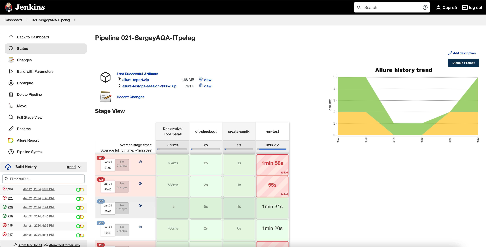
</p>

Для запуска сборки необходимо указать значения параметров и нажать кнопку <code><strong>*Собрать*</strong></code>.

#### Настройка параметров

<p align="center">
  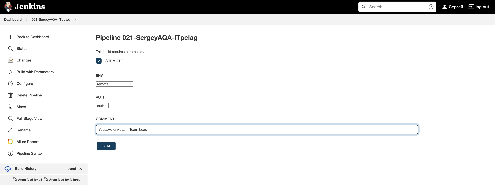
</p>

Результаты сборки можно посмотреть в Allure отчёте, кликнув на значок <code><strong>*Allure Report*</strong></code>.

#### Значок Allure Report

<p align="center">
  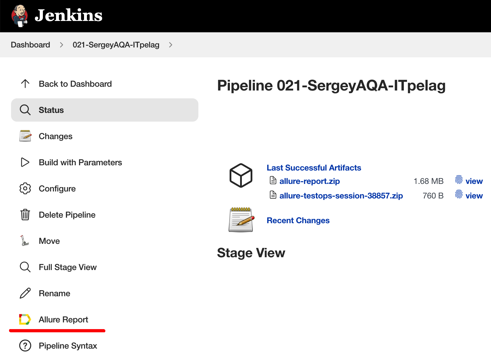
</p>

## Отчет о результатах тестирования в [Allure Report](https://jenkins.autotests.cloud/job/021-SergeyAQA-ITpelag/allure/)

#### Главная страница Allure Report

<p align="center">
  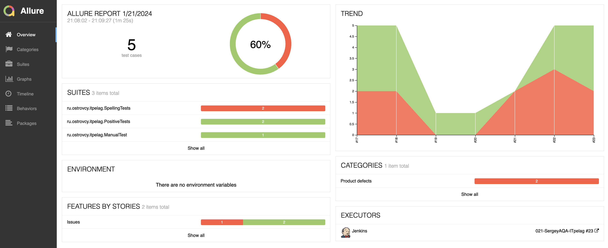
</p>

#### Тесты

<p align="center">
  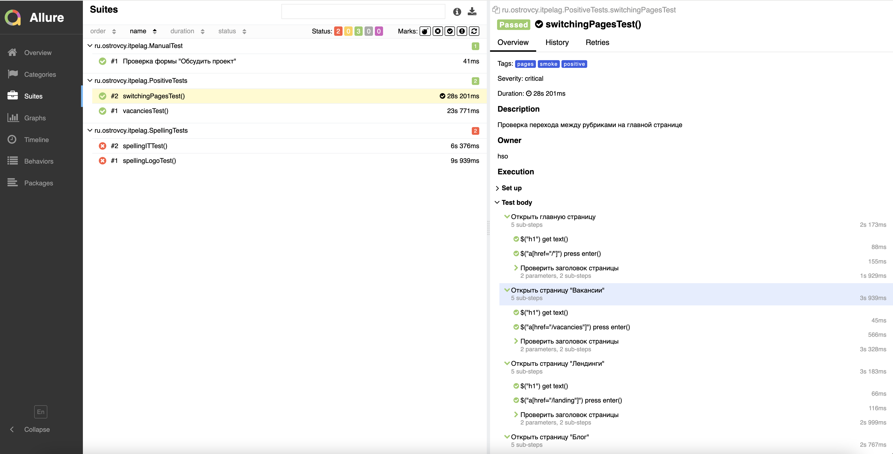
</p>

#### Графики

<p align="center">
  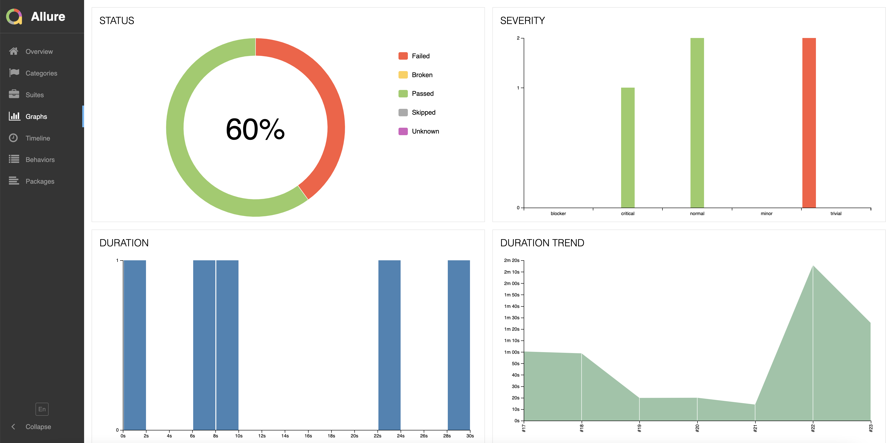
</p>

## Интеграция с [Allure TestOps](https://allure.autotests.cloud/launch/34674)

В <code><strong>*Allure TestOps*</strong></code> есть возможность наблюдать за выполнением тестов в реальном времени.

#### Ход выполнения теста

<p align="center">
  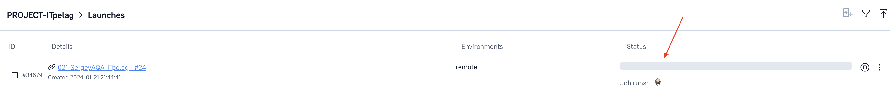
</p>

#### Тест-кейсы

<p align="center">
  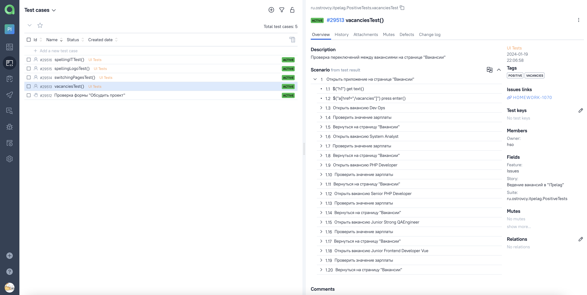
</p>

#### Дашборды

<p align="center">
  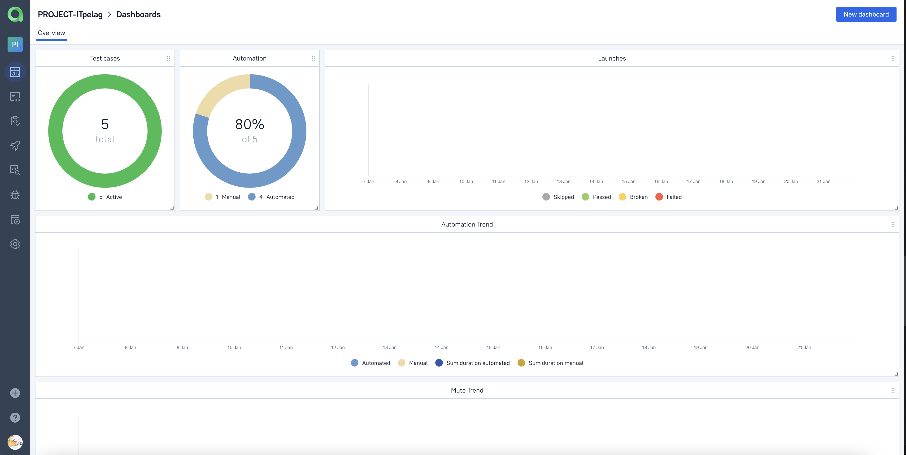
</p>

## Интеграция с [Jira](https://jira.autotests.cloud/browse/HOMEWORK-1070)

#### Задача в Jira

<p align="center">
  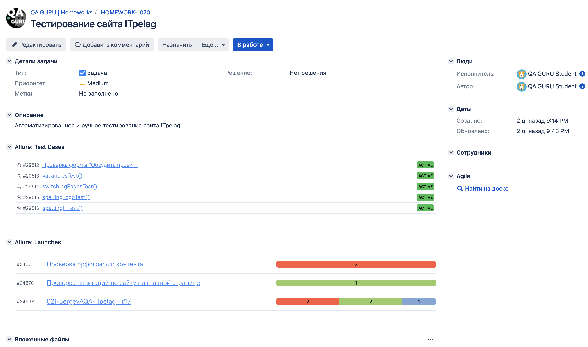
</p>

## Уведомления в Telegram с использованием бота

#### Оповещение о результатах сборки

<p align="center">
  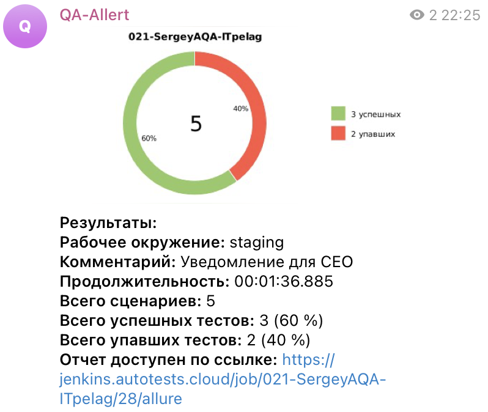
</p>

## Пример запуска теста в Selenoid

К каждому тесту в отчете прилагается видео.

На данном видео выполняется:

- Проверка переходов между вакансиями на странице "Вакансии" и переключений между рубриками на главной странице сайта:

<p align="center">
  
</p>

- Проверка орфографии контента:

<p align="center">
  
</p>